## Variational Information Bottleneck for Semi-supervised Classification

### Abstract

In this paper we consider an information bottleneck (IB) framework for semi-supervised classification with several families of priors on latent space representation. We apply a variational decomposition of mutual information terms of IB. Using this decomposition we perform an analysis of several regularizers and practically demonstrate an impact of different components of variational model on the classification accuracy. We propose a new formulation of semi-supervised IB with hand crafted and learnable priors and link it to the previous methods such as semi-supervised versions of VAE (M1+M2) [1], AAE [2], CatGAN [3], etc. We show that the resulting model allows better understand the role of various previously proposed regularizers in semi-supervised classification task in the light of IB framework. The proposed IB semi-supervised model with hand-crafted and learnable priors is experimentally validated on MNIST under different amount of labeled data.

### IB with hand-crafted priors
#### Supervised training without latent space regularization

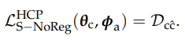
 
 
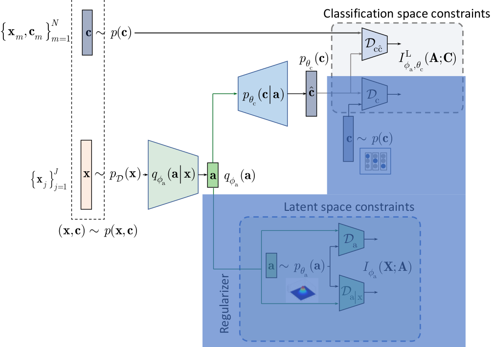

#### Semi-supervised training without latent space regularization

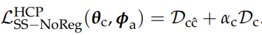
 
 
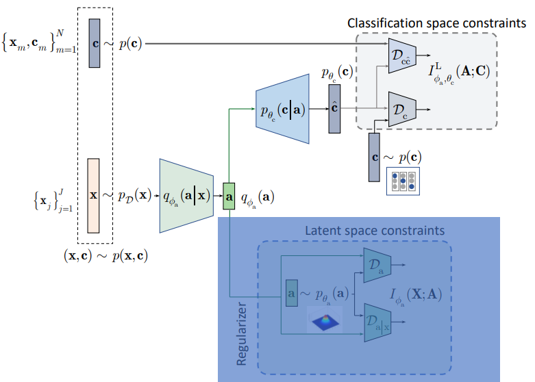

#### Supervised training with latent space regularization

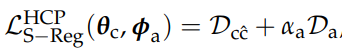
 
 
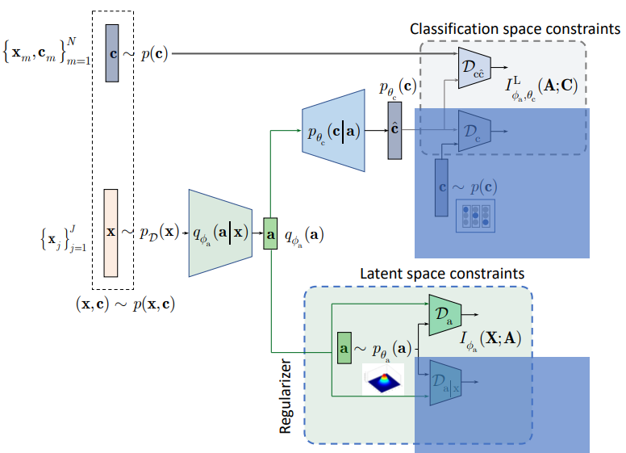

#### Semi-supervised training with latent space regularization

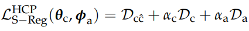
 
 
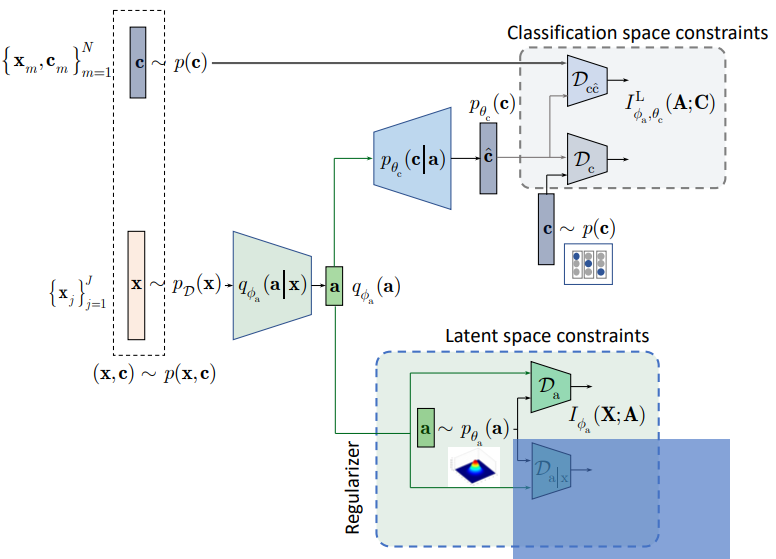

### IB with learnable priors
#### Semi-supervised training with latent space regularization

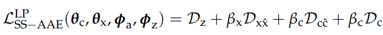
 
 
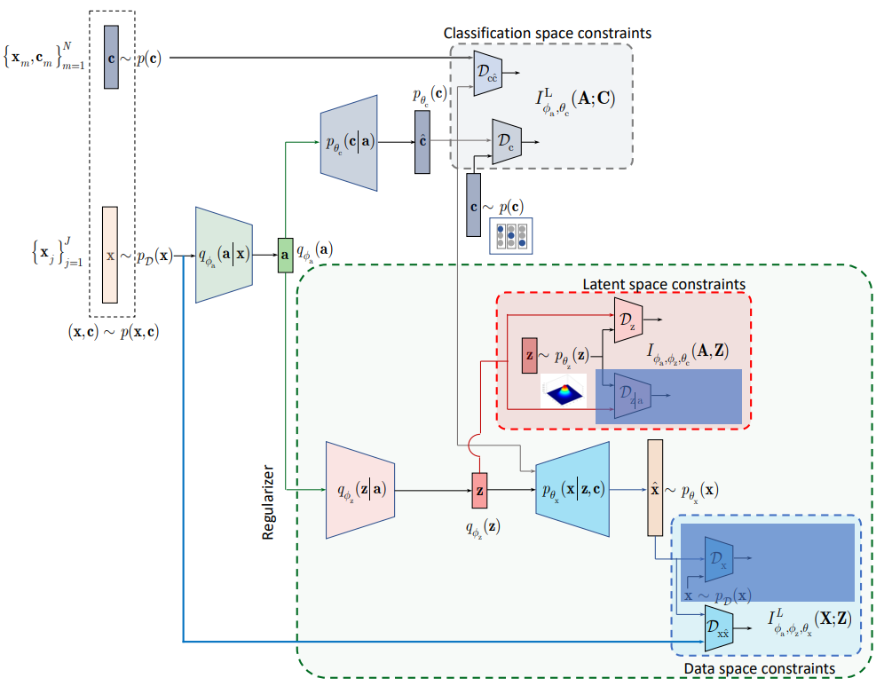

#### Semi-supervised training with latent space regularization and adversarial reconstruction

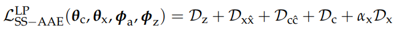
 
 
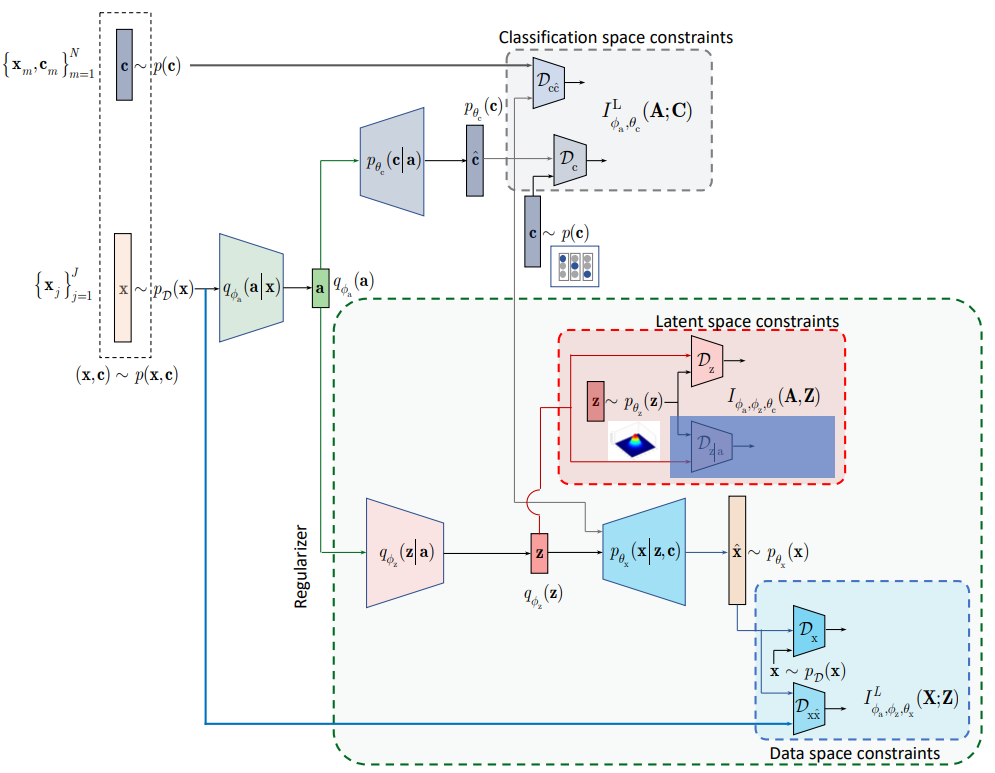

### Experimental results

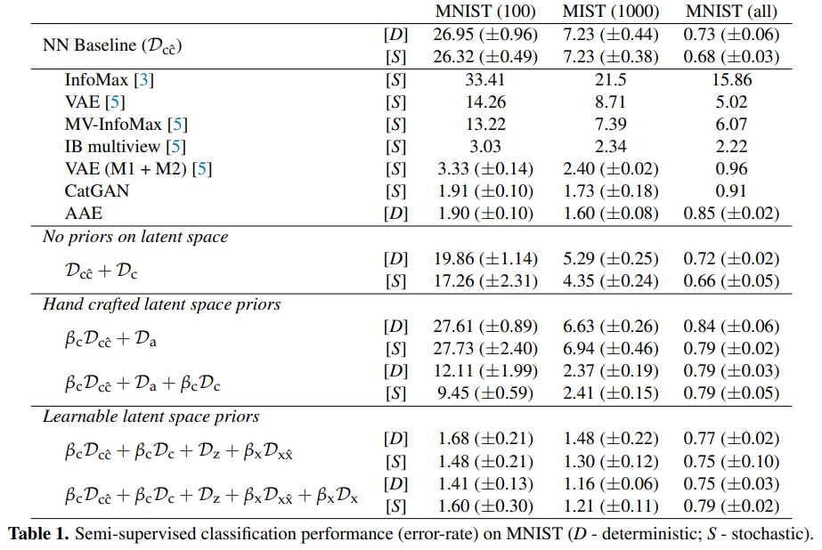

### References
[[1] Durk P Kingma, Shakir Mohamed, Danilo Jimenez Rezende, and Max Welling. "Semi-supervised learning with deep generative models". In Advances in neural information processing systems. 2014.](https://arxiv.org/pdf/1406.5298.pdf)

[[2] Alireza Makhzani, Jonathon Shlens, Navdeep Jaitly, Ian Goodfellow, and Brendan Frey. "Adversarial
autoencoders". arXiv preprint arXiv:1511.05644, 2015.](https://arxiv.org/pdf/1511.05644.pdf)

[[3] Jost Tobias Springenberg. "Unsupervised and semi-supervised learning with categorical generative adversarial
networks". arXiv preprint arXiv:1511.06390, 2015.](https://arxiv.org/pdf/1511.06390.pdf)

[[5] Marco Federici, Anjan Dutta, Patrick Forré, Nate Kushman and Zeynep Akata. "Learning Robust Representations via Multi-View Information Bottleneck". arXiv preprint arXiv:2002.07017, 2020.](https://arxiv.org/pdf/2002.07017.pdf)

